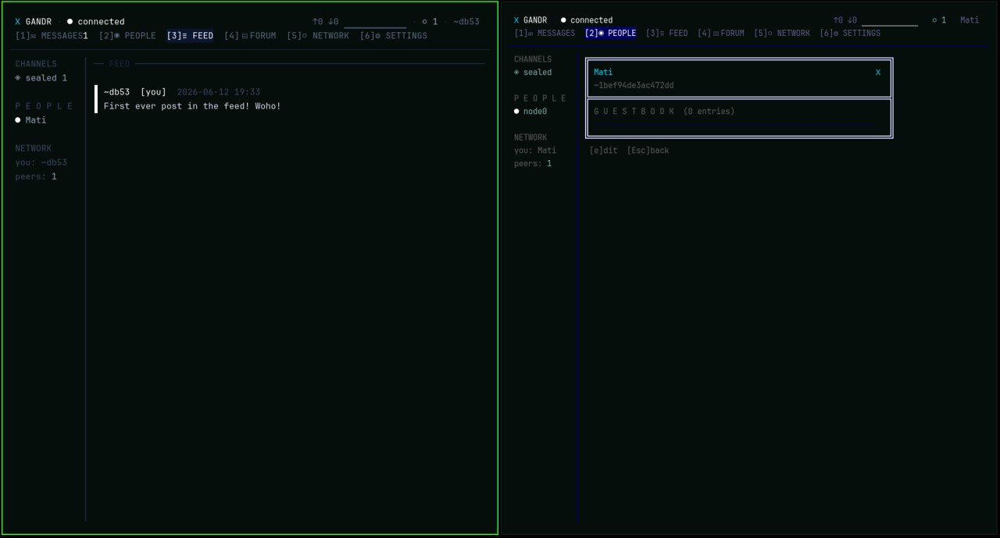

# Gandr ᚷ

A federated, censorship-resistant communication network.

The name is Old Norse — a sending, a magical transmission carried by
invisible force.

- No central authority. No company. No killswitch.
- Identity = Ed25519 keypair. You are your key. No accounts.
- Two binaries: `gandrd` (node daemon), `gandr` (terminal client).
- Transport over the Yggdrasil overlay exclusively — embedded, no
  external daemon, no TUN, no root.
- Signed binary protocol. No HTTP, no REST, no browser. Ever.
- Federation via mutual peering and local trust. No moderation;
  social sanction only.
- No telemetry, no logs of people, no analytics, no auto-update.
- The node is architecturally ignorant of its users. Seizure yields
  nothing actionable.


*Two identities on two federated nodes: a feed post propagating (left)
and a profile card with guestbook (right).*

## Topology

There is no hierarchy and no roles you apply for. Every node embeds
its own Yggdrasil router and peers with whoever it chooses; every link
is mutual, voluntary, and encrypted twice — the overlay session below,
the federation session above. A "seed" is just a well-known first
contact, not an authority. Any node may dial any node by its key,
either side may drop the link, and the mesh shape is whatever its
operators feel like. More links mean more paths; none are required.

```
   ┌──────────────────── the yggdrasil overlay ─────────────────────┐
   │     one encrypted mesh · no center · no registry · no admin    │
   │                                                                │
   │     ⬡ valdis ──────────────────────── ⬡ seed-node              │
   │     │ relay  ╲                      ╱ │  seed·relay·storage    │
   │     │         ╲                    ╱  │                        │
   │     │          ⬡ vps-01 ─────────╱    │                        │
   │     │         ╱   relay·storage       │                        │
   │     │        ╱    (headless: no       │                        │
   │     │       ╱      client, carries    │                        │
   │     │      ╱       traffic anyway)    │                        │
   │     ⬡ basement ─────────────────────── ⬡ pi-attic              │
   │       relay                              storage·relay         │
   │      │     │                              │                    │
   └──────┼─────┼──────────────────────────────┼────────────────────┘
          │     │                              │
          │ unix socket, 0660                  │ (ssh to the pi,
          │     │                              │  run gandr there)
          │     │                              │
      ▭ mati  ▭ guest                       ▭ byte_me
       client  client                        client
      ~1bef…  ~9a02…                        ~db53…
```

A node is a courier, not a host. The `basement` box serves two people
over its local socket; `vps-01` serves nobody and relays anyway; the
identity keys live in the clients' keyfiles, never in any daemon. Move
your keyfile to another machine and you are still you, from any node
that will have you.

How the two kinds of traffic move:

```
  a public post, born at mati's keyboard:

    ▭ mati ─sign─▶ ⬡ basement ─flood─▶ ⬡ valdis ──▶ ⬡ seed-node ─▶ …
                              └─flood─▶ ⬡ vps-01 ──▶ ⬡ pi-attic ─▶ ▭ byte_me

    relayed node to node, stored content-addressed, duplicates damped.
    no algorithm ranks it, no queue reviews it, and only mati's key
    can issue its deletion.

  a sealed message, mati ▶ byte_me:

    ▭ mati ─seal─▶ ⬡ basement ─▶ … whatever path exists … ─▶ ▭ byte_me

    every hop — including both daemons — carries the same opaque,
    zero-padded blob. only byte_me's key opens it; in deniable mode
    even byte_me can't prove to a third party who wrote it.
```

What is conspicuously absent is the point: no server, no account
database, no feed algorithm, no moderation queue, no terms of service.
Trust (untrusted → neutral → trusted → vouched) is a local opinion
about a peer — never negotiated, never transmitted. Nicknames and
blocklists live in the client's encrypted database and nowhere else.
If a node dies, routes around it form; if a node is seized, it yields
envelopes of public messages and sealed blobs it cannot read.

## Status

v0.1 — core protocol complete and tested end to end:

- `pkg/crypto` — Ed25519/X25519, XChaCha20-Poly1305, HKDF, Argon2id,
  sealed messages (Noise X), encrypted keyfiles. Fuzzed.
- `pkg/proto` — signed binary envelope, all 18 message types,
  MessagePack payload schemas, content addressing. Fuzzed.
- `pkg/network` — embedded Yggdrasil transport with a small reliability
  sublayer (fragment/ack/retransmit/dedupe).
- `pkg/federation` — 4-step signed handshake, session encryption,
  trust table. Two real nodes peer over Yggdrasil in the test suite.
- `pkg/store` — content-addressed object store, atomic writes, age
  pruning.
- `pkg/identity` — encrypted identity keyfiles.
- `pkg/ipc` + `cmd/gandrd` — the daemon; full two-daemon
  federation test: chat, profiles, deletes propagate end to end.
- `pkg/clientdb` + `pkg/tui` + `cmd/gandr` — terminal client in full
  BBS dress: four local themes (classic phosphor, midnight, paper,
  ice), compact live header with traffic widget, six intent-based tabs
  (messages / people / feed / forum / network / settings), first-run
  entry manifesto, sidebar, trust badges and bars, inline overlays,
  sealed compose with deniable mode, nicknames (local-only petnames)
  on every surface, optional mouse, IPC auto-reconnect with
  exponential backoff. Responsive from 120-column full layout down to
  40x20 cyberdeck mode.

## Build

```sh
make test    # full suite, includes two-node yggdrasil integration tests
make build   # cross-compiled daemon + native client into dist/
make fuzz    # all fuzz targets, 30s each
```

See `docs/SETUP.md` to run a node, `docs/PROTOCOL.md`,
`docs/FEDERATION.md`, and `docs/SEALED.md` for the wire details.

## Dependencies

Every dependency is a liability; this is the complete list and why:

| module | why |
|--------|-----|
| `yggdrasil-network/yggdrasil-go` | the overlay transport (mandated) |
| `golang.org/x/crypto` | X25519, XChaCha20-Poly1305, Argon2id, HKDF |
| `filippo.io/edwards25519` | Ed25519→X25519 conversion for sealed messages; same code vendored in Go's stdlib, which does not export it |
| `vmihailenco/msgpack` | payload serialization (mandated) |
| `charmbracelet/bubbletea`, `lipgloss` | client TUI (mandated) |
| `mattn/go-sqlite3` | client-local storage (mandated; client only) |
| `BurntSushi/toml` | config format mandated as TOML; stdlib has no TOML |

Client data is encrypted at the application layer (XChaCha20-Poly1305
keyed from the identity key, row-bound AAD) rather than SQLCipher,
which would require a CGO fork outside this list.

## Final note

This is infrastructure, not a product. It has no business model because
it doesn't need one. It has no terms of service because there is no
service. The network is the community that runs it. The protocol is the
only authority. The keypair is the only identity.
